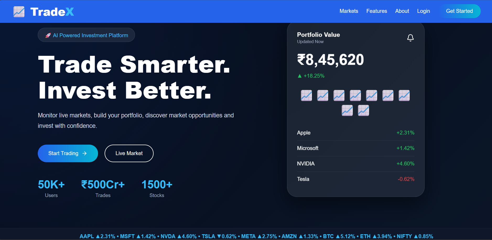
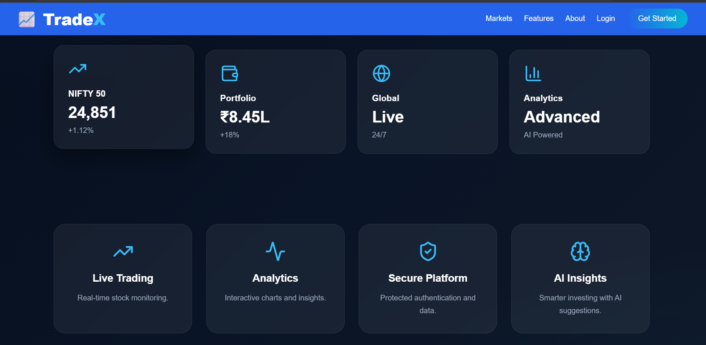
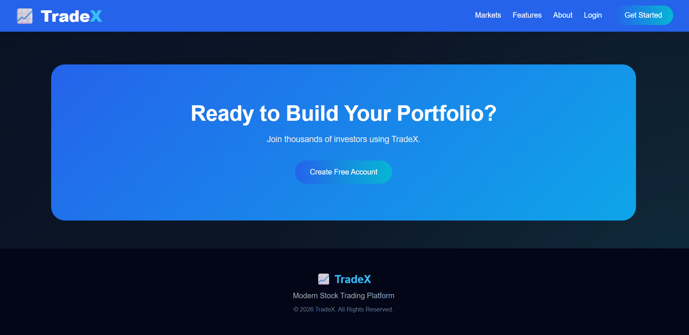
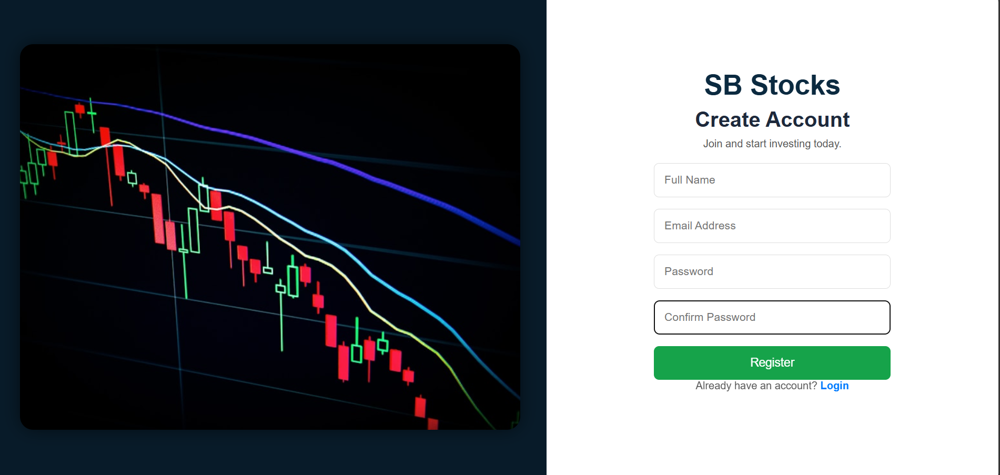
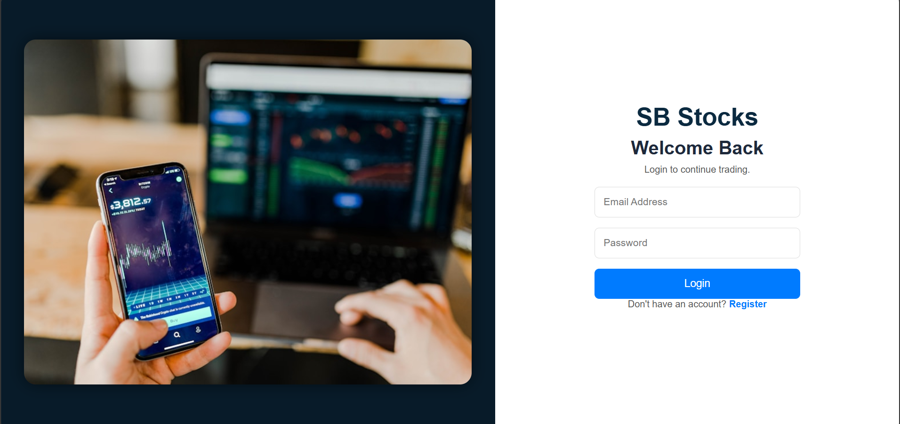
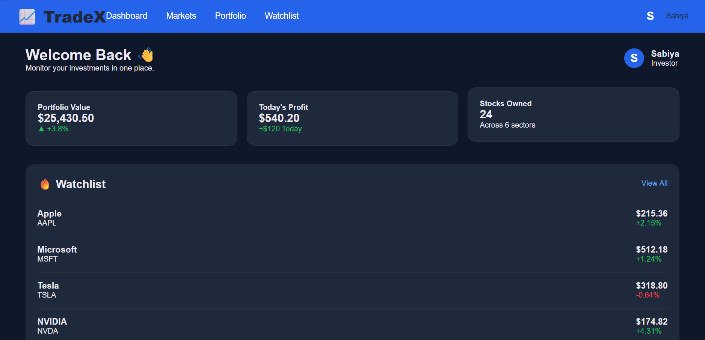
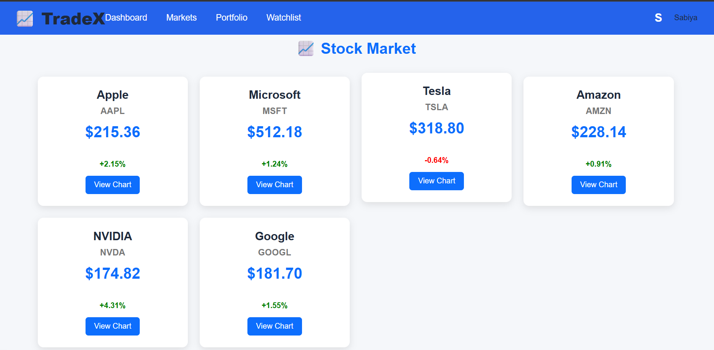
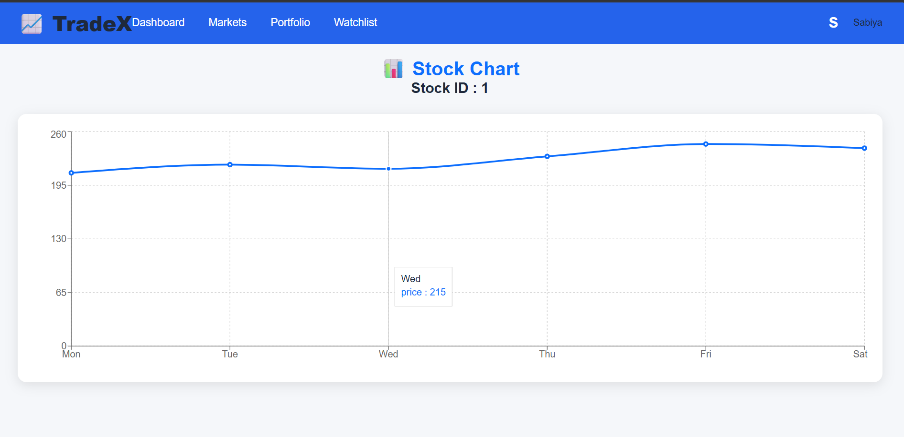

# 📈 TradeX - Stock Trading App

TradeX is a full-stack stock trading web application designed to provide users with a modern platform for tracking stock market trends, monitoring investments, and analyzing stock performance through interactive charts.

The project follows a modern full-stack architecture with separate frontend and backend modules, making it scalable, maintainable, and easy to extend.

# 📌 Table of Contents

- About the Project
- Features
- Tech Stack
- Project Structure
- Installation
- Usage
- Screenshots
- Future Improvements
- Contributing
- License
- Author

# 📖 About the Project

TradeX is developed to help users monitor the stock market through an attractive and user-friendly dashboard. The application provides market insights, portfolio tracking, watchlists, and interactive stock charts in a modern fintech-inspired interface.

The project demonstrates:

- Full-Stack Web Development
- REST API Architecture
- User Authentication
- Protected Routes
- Interactive Dashboard
- Responsive UI Design
- Modern Component-Based Architecture

---

# ✨ Features

### 👤 Authentication
✔ User Registration
✔ User Login
✔ JWT Authentication
✔ Protected Routes
✔ Secure Logout

---

### 📊 Dashboard

✔ Portfolio Overview
✔ Today's Profit & Loss
✔ Total Investment
✔ Stocks Owned
✔ Watchlist
✔ User Profile
---

### 📈 Stock Market
✔ Browse Popular Stocks
✔ View Stock Details
✔ Interactive Stock Charts
✔ Price Change Indicators
✔ Market Overview
---

### 💼 Portfolio
✔ Portfolio Summary
✔ Investment Statistics
✔ Profit Analysis
---

### ⭐ Watchlist
✔ Save Favorite Stocks
✔ Quick Market Access
---

### 👨‍💼 Admin Module
✔ Admin Protected Dashboard
✔ Manage Stock Information
✔ Update Market Data

---

### 🎨 User Interface

✔ Modern Fintech Design
✔ Dark Theme
✔ Responsive Layout
✔ Glassmorphism UI
✔ Animated Components
✔ Professional Landing Page
---

# 🛠 Tech Stack

## Frontend

- HTML5
- CSS3
- JavaScript
- React.js
- React Router DOM
- Axios
- Lucide React

---
## Backend

- Node.js
- Express.js

---

## Database

- MongoDB Atlas
- Mongoose

---

## Authentication

- JSON Web Token (JWT)
- bcryptjs

---

## Tools & Platforms

- Git
- GitHub
- VS Code
- npm
- Vite
- Postman

---

# 📂 Project Structure

```
Stock-Trading-App
│
├── client
│   ├── public
│   ├── src
│   │   ├── assets
│   │   ├── components
│   │   ├── pages
│   │   ├── styles
│   │   ├── App.jsx
│   │   └── main.jsx
│   │
│   ├── package.json
│   └── vite.config.js
│
├── server
│   ├── config
│   ├── controllers
│   ├── middleware
│   ├── models
│   ├── routes
│   ├── uploads
│   ├── server.js
│   ├── package.json
│   └── .env
│
├── README.md
└── .gitignore
```

---

# ⚙ Installation

## Clone Repository

```bash
git clone https://github.com/ParnapalliSabiyaKousar/Stock-Trading-App.git
```

Move into the project directory

```bash
cd Stock-Trading-App
```

---

## Install Frontend Dependencies

```bash
cd client

npm install
```

---

## Install Backend Dependencies

```bash
cd ../server

npm install
```

---

# 🔑 Environment Variables

Create a **.env** file inside the **server** folder.

```env
PORT=5000

MONGO_URI=Your_MongoDB_Connection_String

JWT_SECRET=Your_JWT_Secret
```

---

# ▶️ Usage

## Start Backend

```bash
cd server

npm run dev
```

or

```bash
npm start
```

---

## Start Frontend

```bash
cd client

npm run dev
```

---

Open your browser
```
http://localhost:5173
```
---

# 📸 Screenshots

## Landing Page

- Modern Hero Section
- Animated Background
- Glassmorphism Cards
- AI Trading UI!
!
!
!

## Register
!
Register with an email id

## Login
!
Login with an existing email

## Dashboard

- Portfolio Cards
- Watchlist
- Market Overview
- Profile Menu
!


## Markets

- Stock Cards
- Live Prices
- Stock Charts
!
!
---

# 🎯 Future Improvements

- Live Stock API Integration
- TradingView Charts
- Buy & Sell Stocks
- Payment Integration
- Portfolio Analytics
- Notifications
- AI Price Prediction
- Mobile App
- News Feed
- Real-time Market Updates

---

# 🤝 Contributing

Contributions are welcome.
### Steps to contribute
1. Fork the repository
2. Create a new feature branch
```bash
git checkout -b feature-name
```

3. Commit your changes
```bash
git commit -m "Added new feature"
```
4. Push your branch
```bash
git push origin feature-name
```
5. Create a Pull Request
---
# 📄 License
This project is developed for educational and internship purposes.

# 👩‍💻 Author
## Parnapalli Sabiya Kousar
**B.Tech – Computer Science Engineering**
**Anantha Lakshmi Institute of Technology and Sciences**
### GitHub

https://github.com/ParnapalliSabiyaKousar


